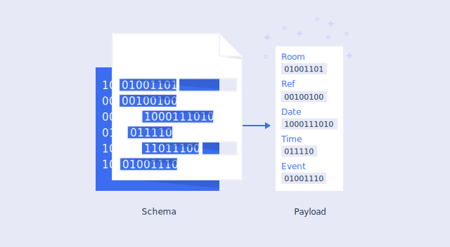
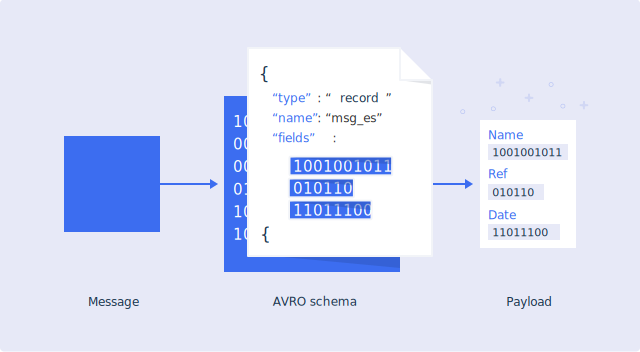

---

copyright:
  years: 2020, 2025
lastupdated: "2025-09-15"

keywords: schema registry, schema

subcollection: EventStreams

---

{{site.data.keyword.attribute-definition-list}}


# Using {{site.data.keyword.messagehub}} Schema Registry
{: #ES_schema_registry}

Schema Registry provides a centralized repository for managing and validating schemas. Schemas in a Schema Registry provide the explicit contract that a program generating an event provides to other programs that are consuming those events.
{: shortdesc}

{: video output="iframe" data-script="none" id="mediacenterplayer" frameborder="0" webkitallowfullscreen mozallowfullscreen allowfullscreen}

## Schemas overview
{: #ES_overview}

Apache Kafka can handle any data, but it does not validate the information in the messages. However, efficient handling of data often requires that it includes specific information in a certain format. Using schemas, you can define the structure of the data in a message, ensuring that both producers and consumers use the correct structure.

Schemas help producers create data that conforms to a predefined structure, defining the fields that need to be present together with the type of each field. This definition then helps consumers parse that data and interpret it correctly. {{site.data.keyword.messagehub}} Enterprise plan supports schemas and includes a Schema Registry for using and managing schemas.

It is common for all of the messages on a topic to use the same schema. The key and value of a message can each be described by a schema.

{: caption="Schemas overview" caption-side="bottom"}

## Schema Registry
{: #ES_registry}

Schemas are stored in the {{site.data.keyword.messagehub}} Schema Registry. In addition to storing a versioned history of schemas, it provides an interface for retrieving them.
Each Enterprise plan {{site.data.keyword.messagehub}} instance has its own Schema Registry.
A maximum of 1000 schemas can be stored in an Enterprise instance. 

Producers and consumers validate the data against the specified schema that is stored in the Schema Registry (in addition to going through Kafka brokers). The schemas do not need to be transferred in the messages this way, meaning the messages can be smaller.

{: caption="Schema Registry architecture" caption-side="bottom"}

## Apache Avro data format
{: #ES_apache_avro_data_format}

Schemas are defined by using [Apache Avro](https://avro.apache.org), an open source data serialization technology that is commonly used with Apache Kafka. It provides an efficient data encoding format, either by using the compact binary format or a more verbose, but human-readable [JSON](https://www.json.org) format.

The {{site.data.keyword.messagehub}} Schema Registry uses Apache Avro data formats. When messages are sent in the Avro format, they contain the data and the unique identifier for the schema used. The identifier specifies which schema in the registry is to be used for the message.

Avro has support for a wide range of data types, including primitive types (null, Boolean, int, long, float, double, bytes, and string) and complex types (record, enum, array, map, union, and fixed).

{: caption="Avro message format" caption-side="bottom"}

## Serialization and deserialization
{: #ES_serialization_and_deserialization}

A producing application uses a serializer to produce messages that conform to a specific schema. As mentioned earlier, the message contains the data in Avro format, together with the schema identifier.

A consuming application then uses a deserializer to consume messages that were serialized by using the same schema. When a consumer reads a message that is sent in Avro format, the deserializer finds the identifier of the schema in the message, and retrieves the schema from the Schema Registry to deserialize the data.

This process provides an efficient way of ensuring that data in messages conforms to the required structure.

The {{site.data.keyword.messagehub}} Schema Registry supports the [Kafka AVRO serializer and deserializer](https://github.com/confluentinc/schema-registry/tree/master/avro-serializer).

{: caption="Serializer and deserializer" caption-side="bottom"}

{: caption="Compatibility and versions" caption-side="bottom"}

## Versions and compatibility
{: #ES_versions_and_compatibility}

Whenever you add a schema, and any subsequent versions of the same schema, {{site.data.keyword.messagehub}} can validate the format automatically and reject the schema if any issues exist. You can evolve your schemas over time to accommodate changing requirements. Create a new version of an existing schema, and the Schema Registry ensures that the new version is compatible with the existing version, meaning that producers and consumers that use the existing version are not broken by the new version.

Schemas are compared to avoid creating duplicate schemas where the schemas differ only in a way that does not affect the semantics of the schema. In some cases, the ordering of the JSON properties within a schema can be crucial to how the schema is used for encoding and decoding data, but in other cases it might not be relevant. 
 
For example, the `name` property of a record schema is not used as part of the encoding and decoding process so you can position it anywhere inside the record JSON object. All these variations are considered the same schema.
 
The `fields` property in the JSON of a record schema is a case where its ordering is important. The Avro specification requires that a record’s fields are encoded and decoded in the order they appear in the schema that is used for the encode and decode operation. 

As an example, consider the following three schemas.

### Schema 1
{: #schema_1}

```json
{
  "type": "record",
  "name": "book",
  "fields": [
    {
      "name": "title",
      "type": "string"
    },
    {
      "name": "author",
      "type": "string"
    }
  ]
}
```

### Schema 2
{: #schema_2}

```json
{
  "type": "record",
  "name": "book",
  "fields": [
    {
      "name": "author",
      "type": "string"
    },
    {
      "name": "title",
      "type": "string"
    }
  ]
}
```

### Schema 3
{: #schema_3}

```json
{
  "type": "record",
  "name": "book",
  "fields": [
    {
      "type": "string"
      "name": "author",
    },
    {
      "type": "string"
      "name": "title",
    }
  ]
}
```

Schema 1 and Schema 2 are distinct schemas and the registry stores them as separate schemas. They cannot be used interchangeably because they list the `author` and `title` fields in a different order. Data encoded with Schema 1 would not be decoded correctly if the decoding process used Schema 2.

When you use the [SerDes](#using_schema_registry_serdes) to create the new schema in the order Schema 1, Schema 2, and Schema 3, the result would be two new schemas. Schema 1 and Schema 2 are different but Schema 3 is the equivalent of Schema 2.

When you create schemas by using the REST API, schemas are considered matching only if they are textually the same, including all attribute ordering and descriptive fields. This is to allow for the case where you want Schema 3 to be a different schema.
{: note}

## Enabling the Schema Registry
{: #enabling_schema_registry}

The Schema Registry is enabled by default for {{site.data.keyword.messagehub}} Enterprise plan service instances. The Schema Registry is not available for other {{site.data.keyword.messagehub}} plans.

## Accessing the Schema Registry
{: #accessing_schema_registry}

To access the Schema Registry, you need the URL of the Schema Registry, which is in the service credentials of your service. To view these credentials in the UI, click your service instance, select **Service Credentials** in the left navigation pane, then click the **View Credentials** link located next to one of the service credentials listed in the table:

{: caption="Kafka credentials block" caption-side="bottom"}

The value of `kafka_http_url` is also the URL of the Schema Registry.

### Authentication
{: #authentication}

To access the Schema Registry, you also need a set of credentials that can be used to authenticate with the registry. There are two options, basic authentication with an API key, or bearer token authentication.

The examples in this document show use of the API key, but either option can be used.
{: note}

#### Authentication with API key
{: #authentication_with_api_key}

The service credentials have an `apikey` that you can use as the credential for authenticating with the Schema Registry.

You can also authenticate by using an API key that was granted from a service ID, providing the service ID has a policy that permits it at least “reader” role access to the {{site.data.keyword.messagehub}} instance. This approach is more flexible and is a better choice if you are granting access to multiple other people or teams. See the [Managing access to your {{site.data.keyword.messagehub}} resources](/docs/EventStreams?topic=EventStreams-security#security_resources) help topic for more details.

The API key is supplied as the password portion of an HTTP basic authentication header. The username portion of the header is the word "token".

The curl command to use is as follows, where $APIKEY is substituted with your API key:

```sh
curl -u token:$APIKEY ...
```

#### Authentication with bearer token
{: #authentication_with_bearer_token}

It is also possible to use a bearer token for a system ID or user as a credential. This is generally a more secure approach, as it has less potential for exposing the API key, and the bearer token automatically expires after some time.

To obtain a token, use the {{site.data.keyword.Bluemix_notm}} CLI `ibmcloud iam oauth-tokens` command to generate the token. Include this token in an HTTP header in the format “Authorization: Bearer $TOKEN”, where $TOKEN is the bearer token:

```sh
curl -H "Authorization: Bearer $TOKEN" ...
```

## Importing data from other schema registries
{: #importing_data_from_other_schema_registries}

You can import data into the Schema Registry that has been exported from other schema registries. When data is imported, the global ID associated with each artifact version is preserved. This means that you can continue to use data that is already stored in Kafka using the same schema global ID values.

The {{site.data.keyword.messagehub}} CLI supports importing data using the import and export format of the Apicurio registry, as in the following example.

```sh
ibmcloud es schema-import import.zip
```

You can generate the data to be imported using the Apicurio registry [exportConfluent](https://github.com/Apicurio/apicurio-registry/tree/main/utils/exportConfluent){: external} utility, which exports data from a Confluent schema registry.
{{site.data.keyword.messagehub}} has been tested with version 2.6.x of this utility.

If the {{site.data.keyword.messagehub}} Schema Registry already has an entry with the same global ID as an artifact version that is being imported, the import operation fails and you are prompted to remove the artifact version if you want to continue.

## Schema Registry REST endpoints
{: #schema_registry_rest_endpoints}

The REST API offers four main capabilities:

1. Creating, reading, and deleting schemas.
2. Creating, reading, and deleting individual versions of a schema.
3. Reading and updating the global compatibility rule for the registry.
4. Creating, reading, updating, and deleting compatibility rules that apply to individual schemas.

For actions that alter the schema version, such as create, update, or delete artifact, artifact versions and rules, an activity tracker event is generated to report the action. For more information, see [{{site.data.keyword.cloudaccesstrailshort}} events](/docs/EventStreams?topic=EventStreams-at_events).

### Errors
{: #errors}

If an error condition is encountered, the Schema Registry returns a non-2XX range HTTP status code. The body of the response contains a JSON object in the following form:

```text
{
    "error_code":404,
    "message":"No artifact with id 'my-schema' might be found."
}
```

The properties of the error JSON object are as follows:

Property name | Description
--- | ---
Error_code | The HTTP status code of the response.
Message | A description of the cause of the problem.
Incident | This field is only included if the error is a result of a problem with the Schema Registry. This value can be used by IBM service to correlate a request to diagnostic information captured by the registry.

### Set a schema state
{: #set_schema_state}

This endpoint is used to set the state of a schema in the registry to either `ENABLED` or `DISABLED`. The state of a schema can be set by issuing a PUT request to the `/artifacts/{schema-id}/state` endpoint (where {schema-id} is the ID of the schema). If the request is successful, an empty response, and a status code of 204 (no content) is returned.

Example curl request:

```sh
curl -u token:$APIKEY –X PUT $URL/artifacts/my-schema/state -d '{"state": "DISABLED"}'
```

Setting a schema state requires:

- Manager role access to the schema resource that matches the schema that is modified.

### Set a schema version state
{: #set_schema_version_state}

This endpoint is used to set the state of a schema version in the registry to either `ENABLED` or `DISABLED`. The state of a schema version can be set by issuing a PUT request to the `/artifacts/{schema-id}/versions/{version}/state` endpoint (where {schema-id} is the ID of the schema, and {version} is the version number of the schema version). If the request is successful, an empty response, and a status code of 204 (no content) is returned.

Example curl request:

```sh
curl -u token:$APIKEY –X PUT $URL/artifacts/my-schema/versions/1/state -d '{"state": "DISABLED"}'
```

Setting a schema version state requires:

- Manager role access to the schema resource that matches the schema being modified.

### Create a schema
{: #create_schema}

This endpoint is used to store a schema in the registry. The schema data is sent as the body of the POST request. An ID for the schema can be included by using the ‘X-Registry-ArtifactId' request header. If this header is not present in the request, an ID is generated. The content type header must be set to “application/json”.

Example curl request:

```sh
curl -u token:$APIKEY -H 'Content-Type: application/json' -H 'X-Registry-ArtifactId: my-schema' $URL/artifacts -d '{"type":"record","name":"Citizen","fields":[{"name": "firstName","type":"string"},{"name":"lastName","type":"string"},{"name":"age","type":"int"},{"name":"phoneNumber","type":"string"}]}'
```

Example response:

```text
{"id":"my-schema","type":"AVRO","version":1,"createdBy":"","createdOn":1579267788258,"modifiedBy":"","modifiedOn":1579267788258,"globalId":75}
```

Creating a schema requires at least both:

- Reader role access to the {{site.data.keyword.messagehub}} cluster resource type.
- Writer role access to the schema resource that matches the schema that is created.

An activity tracker event is generated to report the action. For more information, see [{{site.data.keyword.cloudaccesstrailshort}} events](/docs/EventStreams?topic=EventStreams-at_events).

### List schemas
{: #list_schemas}

You can generate a list of the IDs of all the schemas that are stored in the registry by making a GET request to the `/artifacts` endpoint. You can format the response using the jsonformat parameter (only `string` and `object` formats are supported). The string format is the default and it returns an array of artifact IDs (strings). Only enabled artifacts are included in the array when this options is set. The object format returns a JSON object that contains an array where each entry in the array corresponds to an artifact in the registry. Both enabled and disabled artifacts are returned when this option is set.

Example curl request:

```sh
curl -u token:$APIKEY $URL/artifacts
```

or

```sh
curl -u token:$APIKEY $URL/artifacts?jsonformat=string
```

or

```sh
curl -u token:$APIKEY $URL/artifacts?jsonformat=object
```

Example response when jsonformat is string, or not provided (defaulting to string):

```text
["my-schema-2","my-schema-4"]
```

Example response when jsonformat is object:

```text
{"artifacts":[{"id":"my-schema","state":"DISABLED"},{"id":"my-schema-2","state":"ENABLED"},{"id":"my-schema-3","state":"DISABLED"},{"id":"my-schema-4","state":"ENABLED"}],"count":4}
```

Listing schemas requires at least:

- Reader role access to the {{site.data.keyword.messagehub}} cluster resource type.

### State and deletion of schemas
{: #state_deletion_schema}

Schema deletion is a two-stage process. The first stage of deletion preserves the schema in the registry, but hides it from some operations. The second stage permanently removes the schema, but can only be applied after the first stage. The two-stage deletion process applies at the artifact level and also at the version level. 

The two stages of deletion are done by having an enabled or disabled status associated with both artifacts and versions (first stage), and deleting APIs for resources and versions (second stage). 

An artifact or version that was disabled can be discovered using a ‘state’ property that is returned by operations that list artifacts or versions, or by getting the details of an artifact or version. Disabled schemas count towards the schema quota of 1000 schemas per Enterprise instance. 

### Delete a schema
{: #delete_schema}

Schemas are deleted from the registry by issuing a DELETE request to the `/artifacts/{schema-id}` endpoint (where {schema-id} is the ID of the schema). If successful, an empty response and a status code of 204 (no content) is returned.

Example curl request:

```sh
curl -u token:$APIKEY -X DELETE $URL/artifacts/my-schema
```

Deleting a schema requires at least both:

- Reader role access to the {{site.data.keyword.messagehub}} cluster resource type.
- Manager role access to the schema resource that matches the schema that is deleted.

An activity tracker event is generated to report the action. For more information, see [{{site.data.keyword.cloudaccesstrailshort}} events](/docs/EventStreams?topic=EventStreams-at_events).

### Create a new version of a schema
{: #new_schema}

To create a new version of a schema, make a POST request to the `/artifacts/{schema-id}/versions` endpoint, (where {schema-id} is the ID of the schema). The body of the request must contain the new version of the schema.

If the request is successful, the new schema is created as the latest version of the schema, with an appropriate version number, and a response with status code 200 (OK), and a payload that contains metadata describing the new version (including the version number), is returned.

Example curl request:

```sh
curl -u token:$APIKEY -H 'Content-Type: application/json' $URL/artifacts/my-schema/versions -d '{"type":"record","name":"Citizen","fields":[{"name": "firstName","type":"string"},{"name":"lastName","type":"string"},{"name":"age","type":"int"},{"name":"phoneNumber","type":"string"}]}'
```

Example response:

```text
{"id":"my-schema","type":"AVRO","version":2,"createdBy":"","createdOn": 1579267978382,"modifiedBy":"","modifiedOn":1579267978382,"globalId":83}
```

Creating a new version of a schema requires at least both:

- Reader role access to the {{site.data.keyword.messagehub}} cluster resource type.
- Writer role access to the schema resource that matches the schema that gets a new version.

An activity tracker event is generated to report the action. For more information, see [{{site.data.keyword.cloudaccesstrailshort}} events](/docs/EventStreams?topic=EventStreams-at_events).

### Get the latest version of a schema
{: #latest_schema}

To retrieve the latest version of a particular schema, make a GET request to the `/artifacts/{schema-id}` endpoint (where {schema-id} is the ID of the schema). If successful, the latest version of the schema is returned in the payload of the response.

Example curl request:

```sh
curl -u token:$APIKEY $URL/artifacts/my-schema
```

Example response:

```text
{"type":"record","name":"Citizen","fields":[{"name": "firstName","type":"string"},{"name":"lastName","type":"string"},{"name":"age","type":"int"},{"name":"phoneNumber","type":"string"}]}
```

Getting the latest version of a schema requires at least both:

- Reader role access to the {{site.data.keyword.messagehub}} cluster resource type.
- Reader role access to the schema resource that matches the schema that is retrieved.

### Getting a specific version of a schema
{: #schema_version}

To retrieve a specific version of a schema, make a GET request to the `/artifacts/{schema-id}/versions/{version}` endpoint (where {schema-id} is the ID of the schema, and {version} is the version number of the specific version you need to retrieve). If successful, the specified version of the schema is returned in the payload of the response.

Example curl request

```sh
curl -u token:$APIKEY $URL/artifacts/my-schema/versions/3
```

Example response:

```text
{"type":"record","name":"Citizen","fields":[{"name": "firstName","type":"string"},{"name":"lastName","type":"string"},{"name":"age","type":"int"},{"name":"phoneNumber","type":"string"}]}
```

Getting the latest version of a schema requires at least both:

- Reader role access to the {{site.data.keyword.messagehub}} cluster resource type.
- Reader role access to the schema resource that matches the schema that is retrieved.

### Listing all of the versions of a schema
{: #list_schema_versions}

To list all versions of a schema that are currently stored in the registry, make a GET request to the `/artifacts/{schema-id}/versions` endpoint (where {schema-id} is the ID of the schema). If successful, a list of all current version numbers for the schema is returned in the payload of the response. You can format the response by using the jsonformat parameter (only `number` and `object` formats are supported). If you specify ‘number’ (the default), the response is an array of numeric values that correspond to enabled versions of the artifact (disabled versions are omitted). It is the same format as the endpoint currently generates. If you specifiy ‘object’, the response is a JSON object that contains an array of JSON objects representing versions of the artifact. Both enabled and disabled versions are included in the array.

Example curl request:

```sh
curl -u token:$APIKEY $URL/artifacts/my-schema/versions
```

or

```sh
curl -u token:$APIKEY $URL/artifacts/my-schema/versions?jsonformat=number
```

or

```sh
curl -u token:$APIKEY $URL/artifacts/my-schema/versions?jsonformat=object
```

Example response when jsonformat is number, or not provided (defaulting to number):

```text
[1,3,4,6,7]
```

Example response when jsonformat is object:

```text
{"versions":[{"id":1,"state":"ENABLED"},{"id":2,"state":"DISABLED"},{"id":3,"state":"ENABLED"},{"id":4,"state":"ENABLED"},{"id":5,"state":"DISABLED"},{"id":6,"state":"ENABLED"},{"id":7,"state":"ENABLED"}],"count":7}
```

Getting the list of available versions of a schema requires at least both:

- Reader role access to the {{site.data.keyword.messagehub}} cluster resource type.
- Reader role access to the schema resource that matches the schema that is retrieved.

### Deleting a version of a schema
{: #delete_schema_version}

Schema versions are deleted from the registry by issuing a DELETE request to the `/artifacts/{schema-id}/versions/{version}` endpoint (where {schema-id} is the ID of the schema, and {version} is the version number of the schema version). If successful, an empty response, and a status code of 204 (no content) is returned. Deleting the only remaining version of a schema also deletes the schema.

Example curl request:

```sh
curl -u token:$APIKEY -X DELETE $URL/artifacts/my-schema/versions/3
```

Deleting a schema version requires at least both:

- Reader role access to the {{site.data.keyword.messagehub}} cluster resource type.
- Manager role access to the schema resource that matches the schema that is deleted.

An activity tracker event is generated to report the action. For more information, see [{{site.data.keyword.cloudaccesstrailshort}} events](/docs/EventStreams?topic=EventStreams-at_events).


### Getting the specific global unique ID of a schema version
{: #get_schema_version_ID}

To retrieve a specific global unique ID of a schema version, make a GET request to the `/artifacts/{artifactId}/versions/{version}/meta` endpoint (where {artifactId} is the ID of the artifact, and {version} is the version number of the specific version you need to retrieve). If successful, the specific global unique ID of a schema version is returned in the payload of the response.

Example curl request:

```sh
curl -u token:$APIKEY $URL/artifacts/9030f450-45fb-4750-bb37-771ad49ee0e8/versions/1/meta
```

Example response:

```text
{"id":"9030f450-45fb-4750-bb37-771ad49ee0e8","type":"AVRO","version":1,"createdOn":1682340169202,"modifiedOn":1682340169202,"globalId":1}
```

Getting the global unique ID of a schema version requires at least both the following types of access:

* Reader role access to the {{site.data.keyword.messagehub}} cluster resource type.
* Reader role access to the schema resource that matches the schema that is retrieved.


### Updating a global rule
{: #updating_global_rule}

Global compatibility rules can be updated by issuing a PUT request to the /rules/{rule-type} endpoint (where {rule-type} identifies the type of global rule to be updated - currently the only supported type is COMPATIBILITY), with the new rule configuration in the body of the request. If the request is successful, the newly updated rule config is returned in the payload of the response, together with a status code of 200 (OK).

The JSON document that is sent in the request body must have the following properties:

Property name | Description
--- | ---
Type | Must always be set to the value COMPATIBILITY.
Config | Must be set to one of the following values: NONE, BACKWARD, BACKWARD_TRANSITIVE, FORWARD, FORWARD_TRANSITIVE, FULL, or FULL_TRANSITIVE (See the section on [compatibility rules](/docs/EventStreams?topic=EventStreams-ES_schema_registry#applying_compatibility_rules) for details on each of these values).

Example curl request:

```sh
curl -u token:$APIKEY -X PUT $URL/rules/COMPATIBILITY -d '{"type":"COMPATIBILITY","config":"BACKWARD"}'
```

Example response:

```text
{"type":"COMPATIBILITY","config":"BACKWARD"}
```

Updating a global rule configuration requires at least:

- Manager role access to the {{site.data.keyword.messagehub}} cluster resource type.

An activity tracker event is generated to report the action. For more information, see [{{site.data.keyword.cloudaccesstrailshort}} events](/docs/EventStreams?topic=EventStreams-at_events).

### Getting the current value of a global rule
{: #value_global_rule}

The current value of a global rule is retrieved by issuing a GET request to the /rules/{rule-type} endpoint (where {rule-type} is the type of global rule to be retrieved - currently the only supported type is COMPATIBILITY). If the request is successful, the current rule configuration is returned in the payload of the response, together with a status code of 200 (OK).

Example curl request:

```sh
curl -u token:$APIKEY $URL/rules/COMPATIBILITY
```

Example response:

```text
{"type":"COMPATIBILITY","config":"BACKWARD"}
```

Getting global rule configuration requires at least:

- Reader role access to the {{site.data.keyword.messagehub}} cluster resource type.

### Creating a per-schema rule
{: #schema_rule}

Rules can be applied to a specific schema, overriding any global rules that were set, by making a POST request to the `/artifacts/{schema-id}/rules` endpoint (where {schema-id} is the ID of the schema), with the type and value of the new rule that is contained in the body of the request (currently the only supported type is COMPATIBILITY). If successful, an empty response and a status code of 204 (no content) are returned.

Example curl request:

```sh
curl -u token:$APIKEY $URL/artifacts/my-schema/rules -d '{"type":"COMPATIBILITY","config":"FORWARD"}'
```

Creating per-schema rules requires at least:

- Reader role access to the {{site.data.keyword.messagehub}} cluster resource type.
- Manager role access to the schema resource for which the rule applies.

An activity tracker event is generated to report the action. For more information, see [{{site.data.keyword.cloudaccesstrailshort}} events](/docs/EventStreams?topic=EventStreams-at_events).
 
### Getting a per-schema rule
{: #get_rule}

To retrieve the current value of a type of rule that is applied to a specific schema, a GET request is made to the `/artifacts/{schema-id}/rules/{rule-type}` endpoint (where {schema-id} is the ID of the schema, and {rule-type} is the type of global rule to be retrieved - currently the only supported type is COMPATIBILITY). If the request is successful, the current rule value is returned in the payload of the response, together with a status code of 200 (OK).

Example curl request:

```sh
curl -u token:$APIKEY $URL/artifacts/my-schema/rules/COMPATIBILITY
```

Example response:

```text
{"type":"COMPATIBILITY","config":"FORWARD"}
```

Getting per-schema rules requires at least:

- Reader role access to the {{site.data.keyword.messagehub}} cluster resource type.
- Reader role access to the schema resource to which the rule applies.

### Updating a per-schema rule
{: #update_rule}

The rules applied to a specific schema are modified by making a PUT request to the `/artifacts/{schema-id}/rules/{rule-type}` endpoint (where {schema-id} is the ID of the schema, and {rule-type} is the type of global rule to be retrieved - currently the only supported type is COMPATIBILITY). If the request is successful, the newly updated rule config is returned in the payload of the response, together with a status code of 200 (OK).

Example curl request:

```sh
curl -u token:$APIKEY -X PUT $URL/artifacts/my-schema/rules/COMPATIBILITY -d '{"type":"COMPATIBILITY","config":"BACKWARD"}'
```

Example response:

```text
{"type":"COMPATIBILITY","config":"BACKWARD"}
```

Updating a per-schema rule requires at least:

- Reader role access to the {{site.data.keyword.messagehub}} cluster resource type.
- Manager role access to the schema resource to which the rule applies.

An activity tracker event is generated to report the action. For more information, see [{{site.data.keyword.cloudaccesstrailshort}} events](/docs/EventStreams?topic=EventStreams-at_events).

### Deleting a per-schema rule
{: #delete_rule}

The rules applied to a specific schema are deleted by making a DELETE request to the `/artifacts/{schema-id}/rules/{rule-type}` endpoint (where {schema-id} is the ID of the schema, and {rule-type} is the type of global rule to be retrieved - currently the only supported type is COMPATIBILITY). If the request is successful, an empty response is returned, with a status code of 204 (no content).

Example curl request:

```sh
curl -u token:$APIKEY -X DELETE $URL/artifacts/my-schema/rules/COMPATIBILITY
```

Deleting a per-schema rule requires at least:

- Reader role access to the {{site.data.keyword.messagehub}} cluster resource type.
- Manager role access to the schema resource to which the rule applies.

An activity tracker event is generated to report the action. For more information, see [{{site.data.keyword.cloudaccesstrailshort}} events](/docs/EventStreams?topic=EventStreams-at_events).

## Applying compatibility rules to new versions of schemas
{: #applying_compatibility_rules}

The Schema Registry supports enforcing compatibility rules when you create a new version of a schema. If a request is made to create a new schema version that does not conform to the required compatibility rule, the registry rejects the request. The following rules are supported:

Compatibility Rule | Tested against | Description
--- | --- | ---
NONE | N/A | No compatibility checking is performed when a new schema version is created.
BACKWARD | Latest version of the schema | A new version of the schema can omit fields that are present in the existing version of the schema.
BACKWARD_TRANSITIVE | All versions of the schema | A new version of the schema can add optional fields that are not present in the existing version of the schema.
FORWARD | Latest version of the schema | A new version of the schema can add fields that are not present in the existing version of the schema.
FORWARD_TRANSITIVE | All versions of the schema | A new version of the schema can omit optional fields that are present in the existing version of the schema.
FULL | Latest version of the schema | A new version of the schema can add optional fields that are not present in the existing version of the schema.
FULL_TRANSITIVE | All versions of the schema | A new version of the schema can omit optional fields that are present in the existing version of the schema.

These rules can be applied at two scopes:

1. At a global scope, which is the default that is used when creating a new schema version.
2. At a per-schema level. If a per-schema level rule is defined, it overrides the global default for the particular schema.

By default, the registry has a global compatibility rule setting of `NONE`. Per-schema level rules must be defined, otherwise the schema defaults to using the global setting.

## Full API description
{: #full_api_description}

For a description of the REST API with examples, see [{{site.data.keyword.messagehub}} schema-registry-rest](https://github.com/ibm-messaging/event-streams-docs/tree/master/schema-registry-api){: external}.

You can download the full specification for the API from the [{{site.data.keyword.messagehub}} Schema Registry REST API YAML file](https://github.com/ibm-messaging/event-streams-docs/blob/master/schema-registry-api/openapi.yaml){: external}. To view the Swagger file, use Swagger tools, for example [Swagger editor](https://editor.swagger.io:443/){: external}.

For more information about accessing the Schema Registry using an SDK, see [{{site.data.keyword.messagehub}} Schema Registry REST API](https://github.com/IBM/eventstreams-go-sdk/blob/main/schema_operations.md){: external}.

For information about {{site.data.keyword.messagehub}} resources and data sources on Terraform, see [resources and data sources](https://cloud.ibm.com/docs/ibm-cloud-provider-for-terraform?topic=ibm-cloud-provider-for-terraform-resources-datasource-list#ibm-event-streams_rd){: external}.

## Using the Schema Registry with the third-party SerDes
{: #using_schema_registry_serdes}

Schema Registry supports the use of the following third-party SerDes:

- Confluent SerDes

To configure the Confluent SerDes to use the Schema Registry, you need to specify two properties in the configuration of your Kafka client:

Property name | Value
--- | ---
SCHEMA_REGISTRY_URL_CONFIG | Set this to the URL of the Schema Registry, including your credentials as basic authentication, and with a path of ```/confluent```. For example, if ```$APIKEY``` is the API key to use and ```$HOST``` is the host from the ```kafka_http_url``` field in the **Service Credentials** tab, the value has the form: `https://token:{$APIKEY}@{$HOST}/{confluent}`
BASIC_AUTH_CREDENTIALS_SOURCE | Set to ```URL```. This instructs the SerDes to use HTTP basic authentication using the credentials supplied in the Schema Registry URL.

You can also optionally provide the following properties to control the schema selection (subject naming strategy):

Property name | Value
--- | ---
VALUE_SUBJECT_NAME_STRATEGY | `TopicNameStrategy`(default), `RecordNameStrategy`, and `TopicRecordNameStrategy` are supported. For example, to specify that the schema for the message value is selected using a `TopicRecordNameStrategy`, you might use the following client properties: configs.put(KafkaAvroSerializerConfig.VALUE_SUBJECT_NAME_STRATEGY, TopicRecordNameStrategy.class.getName());
KEY_SUBJECT_NAME_STRATEGY | `TopicNameStrategy` (default), `RecordNameStrategy`, and `TopicRecordNameStrategy` are supported. See VALUE_SUBJECT_NAME_STRATEGY for an example.

The following diagram shows an example of the properties that are required to create a Kafka producer that uses the Confluent SerDes and can be connected to the {{site.data.keyword.messagehub}} service:


{: caption="Kafka properties for Confluent Serdes" caption-side="bottom"}

If a message is sent by using a schema that isn’t in the registry, the SerDes attempts to create the new schema, or version of the schema, in the registry. If this behavior is not required, it can be disabled by removing the writer permission for schema resources from the application. See [Managing access to the Schema Registry](/docs/EventStreams?topic=EventStreams-security#managing_access_schemas).

The *normalize* option for schema lookups and registration is not supported.
{: note}

## Using the Schema Registry with tools that use the Confluent registry API
{: #using_schema_registry_confluent}

The Schema Registry supports a subset of the API provided by version 7.2 of the Confluent Schema Registry. This is intended to provide limited compatibility with tooling that was designed to work with the Confluent Schema Registry. Only the HTTP REST endpoint with the following paths are implemented:

* compatibility
* config
* schemas
* subjects

To configure an application to use this compatibility API, specify the Schema Registry endpoint in the following format:

```text
https://token:{$APIKEY}@{$HOST}/{confluent}
```
{: codeblock}

where:
* `$APIKEY` is the API key to use from the **Service Credentials** tab
* `$HOST` is the host from the `kafka_http_url` field in the **Service Credentials** tab


## Using the Schema Registry with third-party tools
{: #third_party}

The Schema Registry can be tested with third-party tools, such as the `kafka-avro-console-producer.sh` and `kafka-avro-console-consumer.sh`, which allow testing of conformance to schema using the Confluent SerDes.

To run either the producer or the consumer tool, a common property is required with the connection options for the {{site.data.keyword.messagehub}} Enterprise instance.

```text
sasl.jaas.config=org.apache.kafka.common.security.plain.PlainLoginModule required username="token" password="apikey";
security.protocol=SASL_SSL
sasl.mechanism=PLAIN
ssl.protocol=TLSv1.2
ssl.enabled.protocols=TLSv1.2
ssl.endpoint.identification.algorithm=HTTPS
```
{: codeblock}

## Avro console producer and consumer
{: #avro_console_producer }

You can use the Kafka avro console producer and consumer tools with {{site.data.keyword.messagehub}}. You must provide a client property, and in addition, the connection method and credentials for the Schema Registry are required to be supplied as command line `--property` arguments. There are two connection methods by using a credentials source of USER_INFO or of URL.

To execute using the credentials source method of URL, use the following code.

```text
    ./kafka-avro-console-[producer|consumer] --broker-list $BOOTSTRAP_ENDPOINTS --topic schema-test --property schema.registry.url=$SCHEMA_REGISTRY_URL --property value.schema='{"type":"record","name":"myrecord","fields":[{"name":"f1","type":"string"}]}' --property basic.auth.credentials.source=URL --producer.config $CONFIG_FILE
```
{: codeblock}

Replace the following variables in the example with your own values.

* BOOTSTRAP_ENDPOINTS with the value from your {{site.data.keyword.messagehub}} **Service Credentials** tab in the {{site.data.keyword.Bluemix_notm}} console, as the list of your bootstrap servers. 
* SCHEMA_REGISTRY_URL with the `kafka_http_url` value from your {{site.data.keyword.messagehub}} **Service Credentials** tab in the {{site.data.keyword.Bluemix_notm}} console, with the username `token` and apikey, along with the path `/confluent` (for example, `https://{token}:{apikey}@{kafka_http_url}/{confluent}`).
* CONFIG_FILE with the path of the configuration file. 

To execute using the credentials source method of USER_INFO, use the following code.

```text
    ./kafka-avro-console-[producer|consumer] --broker-list $BOOTSTRAP_ENDPOINTS --topic schema-test --property schema.registry.url=$SCHEMA_REGISTRY_URL --property value.schema='{"type":"record","name":"myrecord","fields":[{"name":"f1","type":"string"}]}' --property basic.auth.credentials.source=USER_INFO --property basic.auth.user.info=token:apikey --producer.config $CONFIG_FILE
```
{: codeblock}

Replace the following variables in the example with your own values.

* BOOTSTRAP_ENDPOINTS with the value from your {{site.data.keyword.messagehub}} **Service Credentials** tab in the {{site.data.keyword.Bluemix_notm}} console, as the list of your bootstrap servers.
* SCHEMA_REGISTRY_URL with the `kafka_http_url` value from your {{site.data.keyword.messagehub}} **Service Credentials** tab in the {{site.data.keyword.Bluemix_notm}} console, with the path `/confluent` (for example, `https://{kafka_http_url}/{confluent}`).
* CONFIG_FILE with the path of the configuration file. 
